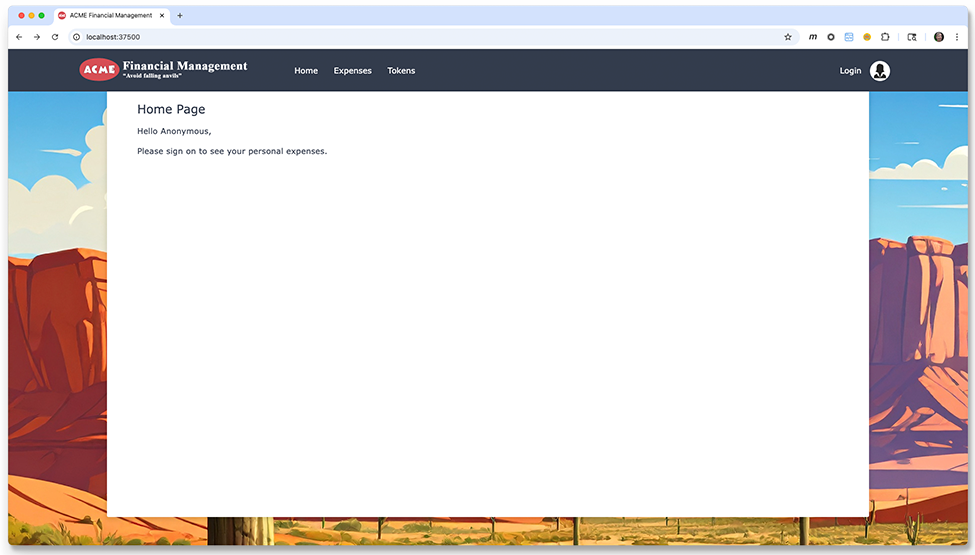
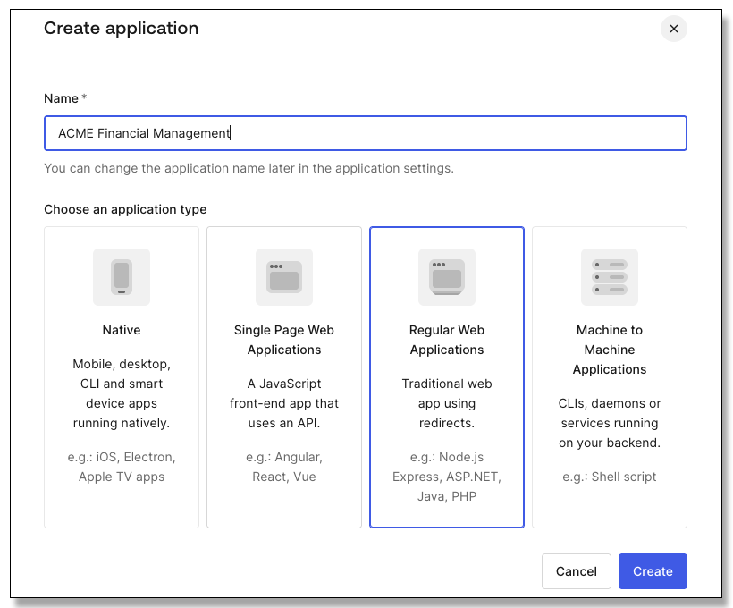
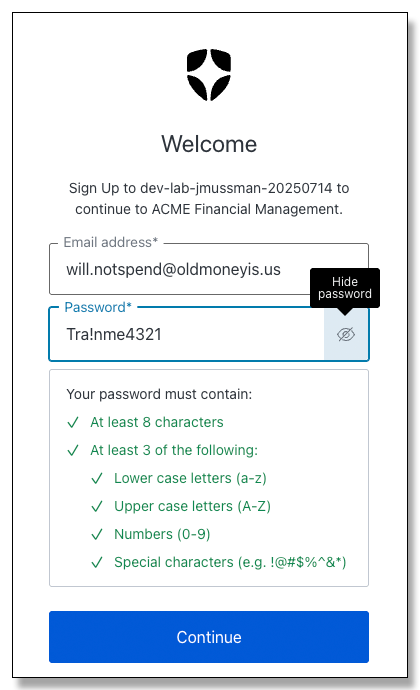
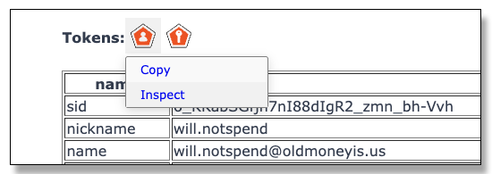

# Lab: Application Integration

## Synopsis

The goal of integrating an application with an Auth0 tenant is to establish trust between both the
application and the tenant.
Trust is based on the application identifying itself to Auth0 and accepting the digitally signed
information that Auth0 provides.

This application is based on the *Express* framework.
Express is a JavaScript framework for web applications and services that
self-hosts using an embedded web server and processes
requests through a chain of middleware functions.
Fundamentally this is the same architecture used by other modern frameworks:
Java Spring Boot, .NET Core, Python Flask, Rack (Ruby), etc.

## Part 1: Setting up the Acme application

1. The first icon in the VS Code toolbar at the left of the windows is the *Explorer* icon
.
Click this to show or hide the *Explorer* panel.
Ctrl/cmd+shift+E is the keyboard shortcut to open the Explorer panel,
and ctrl/cmd+B will toggle the whole sidebar.

1. Expand the *Module 01/Acme/src* directory.
Right-click the *app.js* file and select *Open to the Side*.
VS Code will split the editor panel and show these instructions on the left, and the app.js file on the right.

1. Locate the *Lab/Acme* folder in the Explorer.
Right-click the *Acme* folder and select *Open in Integrated Terminal*.
This puts the terminal that opens in the bottom panel in the correct folder to start with:

    <div style="text-align: center;"></div>

1. In the terminal window
run the *Node Package Manager* command *npm* to install the project dependencies ($ is the prompt):
    ```
    $ npm install
    ```

    NOTE: Do not worry about any warnings from *npm*; deprecated packages and security warnings often
    occur with projects before their dependencies are updated.

1. If you want a little more room to work in the editor, click the Explorer icon on the toolbar to close that panel.
This should be a satisfactory working environment if your display supports 1920x1080 (regular HD) or higher.

1. Open the *Run/Debug* panel from the toolbar 
    
    (the run button with a bug on it).

1. At the top of the Run/Debug panel there is a drop-down box
    with a list of *launch configurations*.
    From this list select *Launch ACME FM*.

1. To the left of the launch configurations dropdown click the run button.
    If there are any errors, fix them and try to launch it again.  

    <div style="text-align: center;"></div>

1. When Run/Debug launches the application, it displays a toolbar where the red square may be used
    to stop the application (do NOT stop it now):

    <div style="text-align: center;"></div>

    NOTE: The run configuration selected launches the app.js file using *nodemon*,
    which monitors the application files for changes.
    Any changes will cause the application to reload automatically.
    You can always restart the application manually with the "recycle" button, or shut down
    the application and restart it:

    <div style="text-align: center;"></div>

1. In the *DEBUG CONSOLE* the last line printed by the application is a link to
    the application landing page.
    This link is clickable: hold down the ctrl/cmd key and click it to open the landing page in the browser:

    <div style="text-align: center;"></div>

    NOTE: The application has not been integrated yet with the Auth0 tenant; the *Login* link will not work properly,
    and clicking on it will produce a 404 page not found.

## Part 2: Registering the Acme application with the Auth0 tenant

1. In your browser open the dashboard for your Auth0 tenant.
If it is already open, go to that tab.

1. In the *Navigation Sidebar* at the left of the dashboard choose *Applications &rarr; Applications*.

1. Click the large blue button that says *+ Create Application*.

1. name the application *ACME Financial Management*, click on *Regular Web Applications*
for the application type, and click the blue *Create* button at the bottom:

    <div style="text-align: center;"></div>

1. On the application configuration page click the *Settings* tab:

    <div style="text-align: center;"></div>

1. Scroll down to the bottom, expand the *Advanced Settings* section,
and click on the *Grants* tab:

    <div style="text-align: center;"></div>

1. Clear the checkboxes except for *Authorization Code* and *Refresh Token*.
At the bottom of the page click the *Save* button.

    NOTE: The concept of "least-privilege" means allow the application to obtain only the
    minimum it needs to perform.
    *Implicit Grant* and *Password Grant* have security issues.
    The *Client Credentials Grant* is for machine-to-machine (M2M) applications.
    The *MFA Grant* and *Passwordless OTP Grant* are proprietary flows that Auth0 provides.
    The application can collect the MFA or OTP from the user and pass it to Auth0.
    The *Client Initiated Backchannel Authentication (CIBA) Grant* is commonly used to scan a QR code
    off a device that does not have a user interface (like a TV) so the authorization may be
    completed on another device such as a smartphone or tablet.

## Part 3: Setting the externalized application configuration

1. In the VS Code editor click on the tab opened earlier for the file *app.js*.
    New files open in the same editor pane as the file with the focus, this will cause the
    next file to open in the right panel.

1. In the Explorer panel (open it temporarily to do this if you closed it) click the *Lab/Acme/.env* file to open it next to *app.js*.

    NOTE: This file holds externalized configuration variables.
    Configuration should not be hardwired into the application, that would require
    modifications and rebuilding for each deployment.
    The application will read the configuration from this file using the
    *dotnet* NodeJS package.

1. In the Auth0 tenant locate the value of the *Domain* property on the application
    settings page.
    Set the *ISSUER_BASE_URL* property in the .env file
    to *https://* followed by the value of the Domain property.
    It will look similar to this, but with a different domain name:
    ```
    ISSUER_BASE_URL=https://dev-lab-jmussman-20250506.us.auth0.com
    ```

1. Copy the values from the application configuration at Auth0 for the CLIENT_ID
and the CLIENT_SECRET and set the corresponding properties in the .env file:
    ```
    CLIENT_ID=...
    CLIENT_SECRET=...
    ```

1. NOTE: Just for your information the remaining two environment variables:
    ```
    PORT=37500
    SECRET="a long, randomly-generated string stored in env"
    ```

    The TCP/IP PORT number is externalized so that it may be changed if necessary.
    This is where the application listens on the local host for connections.
    Of course the public port on the Internet could be something else mapped by a router or firewall.

    SESSION_SECRET is used by the *express-session* package (*Express* middleware) to
    encrypt the session key stored in the user browser.
    It really does not matter what the value is, just that it is externalized so
    that the value may be randomly changed if necessary.

1. Save the file.

    NOTE: The configuration is not yet complete because the
    login and logout callback URLs on the Auth0 application settings page are not set.
    If the lab is performed using GitHub Codespace the URL and port number are not yet known!

## Part 4: Integrating authentication into the Express application

1. In the terminal window opened in the Acme folder
    add the *epxress-oopenid-connect* (the Auth0 Express SDK) package
    to the project with the following *npm* command:
    ```bash
    $ npm install express-openid-connect
    ```

1. Click on the tab for the *app.js* file in the right editor panel.

1. The installed NodeJS packages must be referenced by the application code to use them.
    Add the following import statement
    after the existing import statements at the top of the *app.js* file:
    ```js
    import auth0Express from 'express-openid-connect'
    ```

    NOTE: If you are wondering about semicolons in the JavaScript code, technically JavaScript
    does not use them (they are ignored).
    Many folks still use them as a hangover from C, C++, Java, C#, and other languages.
    You can use them if you like.
    This example follows accepted conventions and does not include them.

1. *express-openid-connect* is built as a *CommonJS* module, not an ES6 (JavaScript 2016)
    module.
    Add this statement after the imports to destructure the CommonJS module object into the 
    variables the application requires:
    ```js
    const { auth, requiresAuth } = auth0Express
    ```

    NOTE: *Destructuring* is the JavaScript technique to assign the property values of an object into individual variables. In this case JavaScript copies the values of the *auth* and *requiresAuth* properties from the
    imported module and assigns them to local auth and requiresAuth variables.
    The only reason for doing this is to access the functions *auth* and *requiresAuth* without
    the syntax to traverse the original object.

1. Locate this block of code that establishes the *session manager* for the application:
    ```js
    // Use sessions
    app.use(
        session({
            secret: process.env.SECRET,
            resave: false,
            saveUninitialized: false,
            cookie: {
                httpOnly: false,
                sameSite: 'lax',
                secure: false
            }
        })
    )
    ```

    NOTE: Web applications use session cookies in the browser to identify an established
    session for a particular instance where a user has been authorized.
    A missing session indicates an unauthorized user, which may cause the application
    to redirect the user to the Auth0 tenant for authorization.

1. Following the session registration in the previous step add this call to
    register the middleware to handle Auth0 authorization:
    ```js
    app.use(
        auth({
            issuerBaseURL: process.env.ISSUER_BASE_URL,
            baseURL: process.env.BASE_URL,
            clientID: process.env.CLIENT_ID,
            clientSecret: process.env.CLIENT_SECRET,
            secret: process.env.SECRET,
            idpLogout: true,
            authRequired: false,
            authorizationParams: {
                response_type: "code"
            }
        })
    )
    ```

    NOTE: The *auth* function produces a function that may be registered as express
    middleware.

    The assignment of *ISSUER_BASE_URL, BASE_URL, CLIENT_ID, CLIENT_SECRET*, and *SECRET*,
    is obvious (BASE_URL is dynamic and defined at the top of the application).

    *idpLogout* is set to true; this customer-facing application will log the user
    out of the Auth0 tenant and clear the session there when the SDK logout method is called.

    *authRequired* is *false* to allow selected application endpoints to
    require authentication; *true* means every endpoint requires authentication.

    *authorizationParams.response_type* is set to *code* to select the OAuth2
    *Authorization Code Grant* instead of the *Implicit Grant*.

1. Locate the following middleware registration for the */expenses* endpoint:
    ```js
    app.get("/expenses", async (req, res) => {...
    ```

1. Change the registration for */expenses* to look like this:
    ```js
    app.get("/expenses", requiresAuth(), async (req, res) => {
    ```

1. Locate the following middleware registration for the */tokens* endpoint:
    ```js
    app.get("/tokens", async (req, res) => {...
    ```

1. Add the *requiresAuth(), * middleware to the registration to
    require authorization for the */user* endpoint:
    ```js
    app.get("/tokens", requiresAuth(), async (req, res) => {
    ```

## Part 5: Testing the Express application

1. Move back to the application page in the browser:

    <div style="text-align: center;"></div>

1. Click the login button at the top right.
The authorization request will fail, click the link at the bottom left of the page
to see the error details:

    <div style="text-align: center;"></div>

    NOTE: Never trust the URL that Auth0 displays.
    The application could have sent the wrong information, or it could
    be a counterfeit application!

1. Return to the *DEBUG CONSOLE* panel in VS Code, locate the URL used to launch the
    application, and copy it.

1. In the Auth0 tenant find the application configuration and look at the *Settings* tab.
    Scroll down the page until you find the section for *Application URIs*.
    Locate the *Allowed Logout URLs* and paste the application URL in that field
    (the URL for your application may be different):

    <div style="text-align: center;"></div>

    NOTE: if the development is in a GitHub Codespace the URL will have a generated name
    like "funky-codespace".

    The default return page for logout is the landing page of the application, hence the URL
    for the application being placed here.

1. Just above that locate find the *Allowed Callback URLs*.
Paste the copied URL there too and then append */callback* to the end of it:

    <div style="text-align: center;"></div>

    Note: The */callback* endpoint is defined by the Auth0 middleware
    registered with Express earlier.
    The endpoint does not appear in the app.js file. 

1. Click *Save* to set the changes to the application configuration.

1. On the error page that Auth0 displayed click the back button and return to the
application landing page.

1. Click the login button at the top right again, and follow the *Sign up* link
    to create a new user.

    <div style="text-align: center;"></div>

1. The email address used to create a new account does not have to be a real email address.
    Use "will.notspend@oldmoneyis.us" and set the password to "Tra!nme4321":

    <div style="text-align: center;"></div>

1. If you are working on the project locally, and only then, an idiosyncrasy of Auth0 is that applications
running are localhost always require consent.
This is to protect users from malware running launching a counterfeit *phishing application* locally on their computer.
Developers running testing applications in a local sandbox just need to live with it.
You will not see this if an HTTPS address to a GitHub Codespace is used.
If you do encounter it click the *Accept* button to consent:

    <div style="text-align: center;"></div>

1. Once you land on the *Home* page, you can click the username on the page
or the *Tokens* menu item in the header bar to see the user details:

    <div style="text-align: center;"></div>

1. Hover over the first button, the ID token.
    From the menu pick *Inspect*, and the application will open the token at [https://jwt.io](https://jwt.io) with the details:

    <div style="text-align: center;"></div>

1. When you are finished exploring the application log the user out with the *Logout* link.

1. Click on the *Expenses* menu link in the header.
    This requires authentication and will display the login page.
    Authenticate as *will.notspend@oldmoneyis.us* with the password *Tra!nme4321*.

1. Verify you land on the expenses page, and then log the user out.

    NOTE: This is one of two forms of handling authorization, also known as "immediate login": when the user attempts to access a secured resource
    take them through authorization.
    The other option is "deferred login", where a message is displayed stating the resource is protected and asking them to login.

1. Stop the application with red square in the Run/Debug toolbar in VS Code:

    <div style="text-align: center;"></div>

<br>
**Congratulations, you have completed this lab!**

If you are working inside a GitHub Codespace you may close and delete the Codespace.
If you are inside a Docker Container you may delete the docker container, and the image that
launched it.